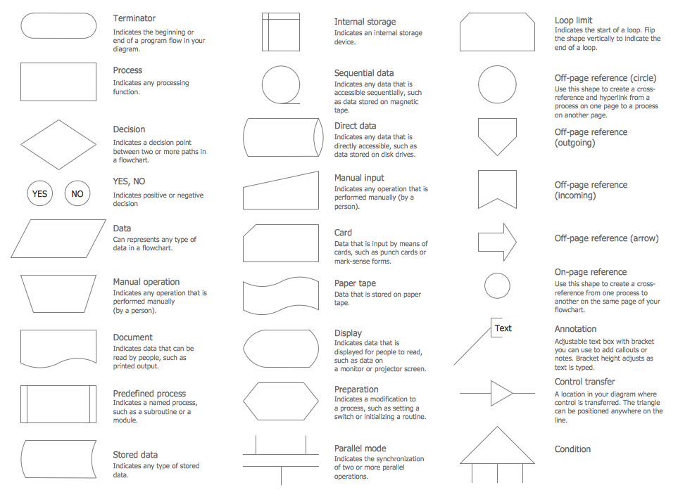
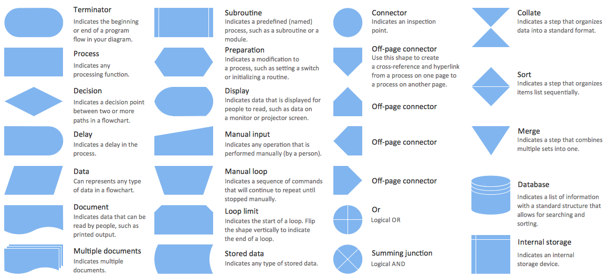
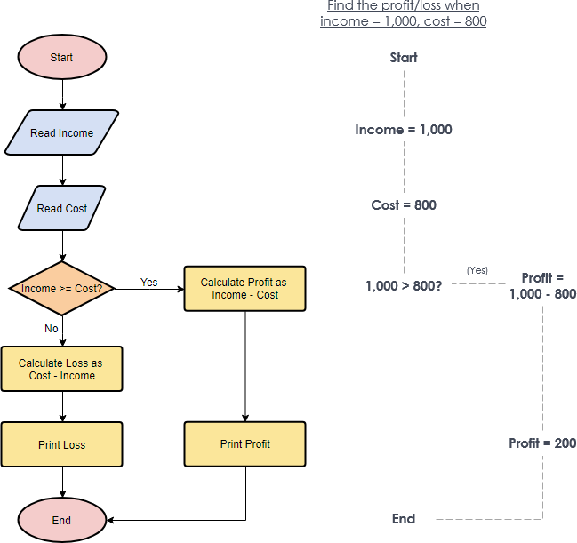
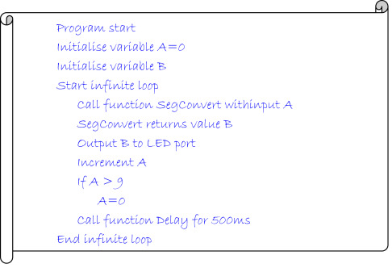
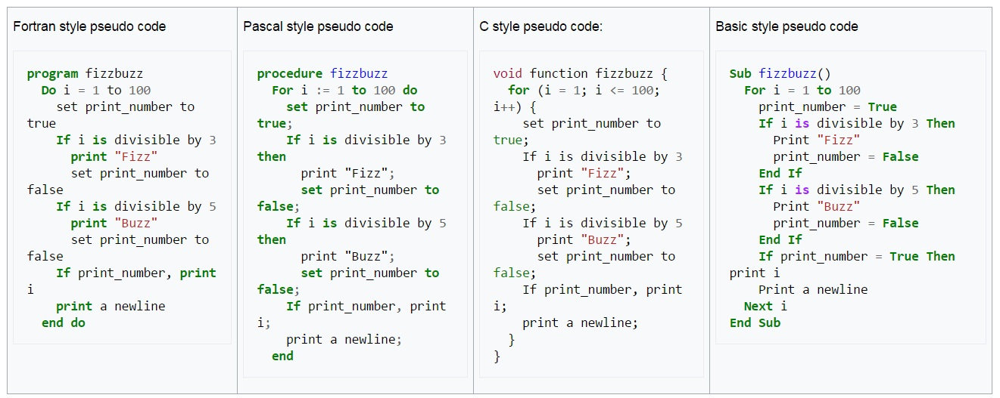

# 100 Days Of Code - Day 1 20-08-2021
## Topic - Flow Chart, Pesudo Code
## Book -

## Notes
### Flow Chart
Flowcharts are written with program flow from the top of a page to the bottom. Each command is placed in a box of the appropriate shape, and arrows are used to direct program flow.

**Example:**

### Peudo Code
Pseudocode is a method of describing computer algorithms using a combination of natural language and programming language.

It is essentially an intermittent step towards the development of the actual code.  It allows the programmer to formulate their thoughts on the organization and sequence of a computer algorithm without the need for actually following the exact coding syntax.

**Example:**

